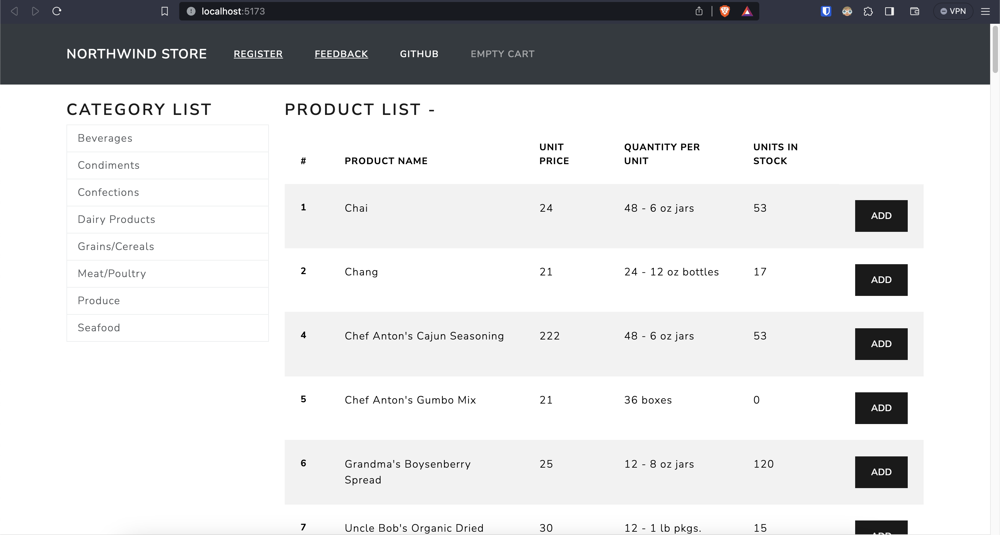
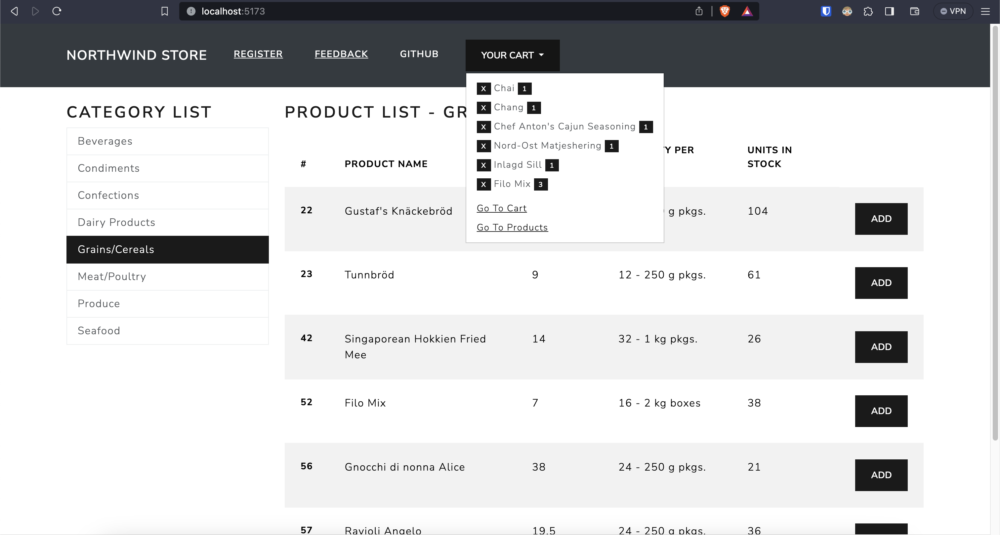
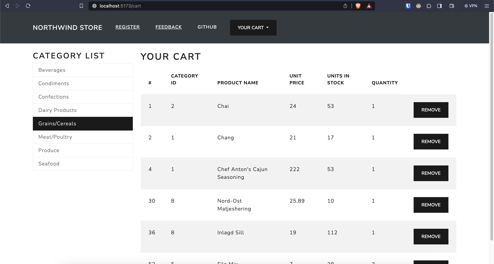

# Northwind Store

### Contents

- [About Project](#project)
- [JSON Server and Northwind DB](#get-started)
- [Tech Stack](#tech-stack)
- [Components](#components)
- [Usage](#usage)

### About Project <a name="project"></a>

This is an online store project with some functionalities.







### JSON Server and Northwind DB <a name="get-started"></a>

JSON Server is a lightweight and easy-to-use Node.js tool that simulates a RESTful API using a JSON file as the data source.

`api/db.json` is used to fetch data.

The data inside `db.json` is taken from the `Northwind DB`.

The `Northwind database` is a sample database used by Microsoft to demonstrate the features of some of its products, including SQL Server.

`Products` and `Categories` are used for this project.

### Tech Stack <a name="tech-stack"></a>

- React
- React-Bootstrap
- React-Router-Dom
- TypeScript
- Northwind data

### Components <a name="components"></a>

- CartList
- CartSummary
- CategoryList
- Feedback
- NavigationBar
- NotFound
- ProductList
- Register

### Usage <a name="usage"></a>

Clone the repository.

```bash
git clone https://github.com/berkesayin/northwind-store.git
```

Install the dependencies.

```bash
npm install
```

Install JSON Server

```bash
npm install -g json-server
```

`api/db.json` file is used here with some `Products` and `Categories` data.

Locate `api` folder at terminal.

```bash
cd api
```

Start JSON Server

```bash
json-server --watch db.json
```

Now if you go to [http://localhost:3000/posts/1](http://localhost:3000/products/1), you'll get;

```js
{
  "id": 1,
  "categoryId": 2,
  "productName": "Chai",
  "quantityPerUnit": "48 - 6 oz jars",
  "unitPrice": "24",
  "unitsInStock": 53
}
```

If you go to [http://localhost:3000/categories/1](http://localhost:3000/categories/1), you'll get;

```
{
  "id": 1,
  "categoryName": "Beverages",
  "seoUrl": "beverages"
}
```

Locate the root directory at terminal, and start the project.

```bash
npm run dev
```
